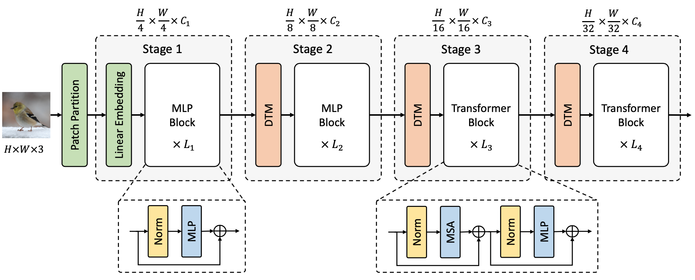
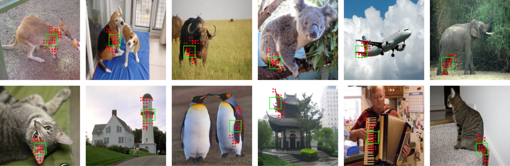

# Less is More: Pay Less Attention in Vision Transformers

[](https://opensource.org/licenses/Apache-2.0) 
<a href="https://pytorch.org/get-started/locally/"></a>

This is the official PyTorch implementation of AAAI 2022 paper: **Less is More: Pay Less Attention in Vision Transformers**.

By [Zizheng Pan](https://scholar.google.com.au/citations?user=w_VMopoAAAAJ&hl=en), [Bohan Zhuang](https://sites.google.com/view/bohanzhuang), [Haoyu He](https://scholar.google.com/citations?user=aU1zMhUAAAAJ&hl=en), [Jing Liu](https://sites.google.com/view/jing-liu/%E9%A6%96%E9%A1%B5) and [Jianfei Cai](https://scholar.google.com/citations?user=N6czCoUAAAAJ&hl=en).





In our [paper](https://arxiv.org/abs/2105.14217), we present a novel Less attention vIsion Transformer (LIT), building upon the fact that the early self-attention layers in Transformers still focus on local patterns and bring minor benefits in recent hierarchical vision Transformers. LIT uses pure multi-layer perceptrons (MLPs) to encode rich local patterns in the early stages while applying self-attention modules to capture longer dependencies in deeper layers. Moreover, we further propose a learned deformable token merging module to adaptively fuse informative patches in a non-uniform manner.


If you use this code for a paper please cite:

```
@inproceedings{pan2022litv1,
  title={Less is More: Pay Less Attention in Vision Transformers},
  author={Pan, Zizheng and Zhuang, Bohan and He, Haoyu and Liu, Jing and Cai, Jianfei},
  booktitle = {AAAI},
  year={2022}
}
```

## Updates

- **19/06/2022.** We introduce [LITv2](https://arxiv.org/abs/2205.13213), a faster and better Vision Transformer with a novel efficient HiLo attention. Code and pretrained weights have also been released [here](https://github.com/ziplab/LITv2).

- **10/03/2022.** Add visualisation code for attention maps in Figure 3. Please refer to [here](https://github.com/zhuang-group/LIT#attention-map-visualisation).


## Usage

First, clone this repository.

```bash
git clone git@github.com:ziplab/LIT.git
```

Next, create a conda virtual environment.

```bash
# Make sure you have a NVIDIA GPU.
cd LIT/classification
bash setup_env.sh [conda_install_path] [env_name]

# For example
bash setup_env.sh /home/anaconda3 lit
```

**Note:** We use PyTorch 1.7.1 with CUDA 10.1 for all experiments. The `setup_env.sh` has illustrated all dependencies we used in our experiments. You may want to edit this file to install a different version of PyTorch or any other packages.


## Image Classification on ImageNet

We provide baseline LIT models pretrained on ImageNet-1K. For training and evaluation code, please refer to [classification](https://github.com/ziplab/LIT/tree/main/classification).

| Name   | Params (M) | FLOPs (G) | Top-1 Acc. (%) | Model                                                        | Log                                                          |
| ------ | ---------- | --------- | -------------- | ------------------------------------------------------------ | ------------------------------------------------------------ |
| LIT-Ti | 19         | 3.6       | 81.1           | [google drive](https://drive.google.com/file/d/19X3u-0BtXXZRlWZeSe5e-Z0ocS6rWCFb/view?usp=sharing)/[github](https://github.com/ziplab/LIT/releases/download/v1.0/lit_ti.pth) | [log](https://github.com/ziplab/LIT/releases/download/v1.0/log_lit_ti.txt) |
| LIT-S  | 27         | 4.1       | 81.5           | [google drive](https://drive.google.com/file/d/1WbXspSpUFmiFEeJov4LNWEOLlgUO6eKs/view?usp=sharing)/[github](https://github.com/ziplab/LIT/releases/download/v1.0/lit_s.pth) | [log](https://github.com/ziplab/LIT/releases/download/v1.0/log_rank0_lit_small.txt) |
| LIT-M  | 48         | 8.6       | 83.0           | [google drive](https://drive.google.com/file/d/1HYJLmKSYO5rgGWPynzEMEG_TYEqFA0oy/view?usp=sharing)/[github](https://github.com/ziplab/LIT/releases/download/v1.0/lit_m.pth) | [log](https://github.com/ziplab/LIT/releases/download/v1.0/log_rank0_lit_medium.txt) |
| LIT-B  | 86         | 15.0      | 83.4           | [google drive](https://drive.google.com/file/d/1EX2CbCVUbc3IVFWdlnRoh7GBWov91iXb/view?usp=sharing)/[github](https://github.com/ziplab/LIT/releases/download/v1.0/lit_b.pth) | [log](https://github.com/ziplab/LIT/releases/download/v1.0/log_rank0_lit_base.txt) |


## Object Detection on COCO

For training and evaluation code, please refer to [detection](https://github.com/ziplab/LIT/tree/main/detection).


### RetinaNet

| Backbone | Params (M) | Lr schd | box mAP | Config                                                       | Model                                                        | Log                                                          |
| -------- | ---------- | ------- | ------- | ------------------------------------------------------------ | ------------------------------------------------------------ | ------------------------------------------------------------ |
| LIT-Ti   | 30         | 1x      | 41.6    | [config](https://github.com/ziplab/LIT/blob/main/detection/configs/lit/retinanet_lit_ti_fpn_1x_coco.py) | [github](https://github.com/ziplab/LIT/releases/download/v2.0/retina_lit_ti.pth) | [log](https://github.com/ziplab/LIT/releases/download/v2.0/retina_lit_ti.json) |
| LIT-S    | 39         | 1x      | 41.6    | [config](https://github.com/ziplab/LIT/blob/main/detection/configs/lit/retinanet_lit_s_fpn_1x_coco.py) | [github](https://github.com/ziplab/LIT/releases/download/v2.0/retina_lit_s.pth) | [log](https://github.com/ziplab/LIT/releases/download/v2.0/retina_lit_s.json) |


### Mask R-CNN

| Backbone | Params (M) | Lr schd | box mAP | mask mAP | Config                                                       | Model                                                        | Log                                                          |
| -------- | ---------- | ------- | ------- | -------- | ------------------------------------------------------------ | ------------------------------------------------------------ | ------------------------------------------------------------ |
| LIT-Ti   | 40         | 1x      | 42.0    | 39.1     | [config](https://github.com/ziplab/LIT/blob/main/detection/configs/lit/mask_rcnn_lit_ti_fpn_1x_coco.py) | [github](https://github.com/ziplab/LIT/releases/download/v2.0/mask_rcnn_lit_ti.pth) | [log](https://github.com/ziplab/LIT/releases/download/v2.0/mask_rcnn_lit_ti.json) |
| LIT-S    | 48         | 1x      | 42.9    | 39.6     | [config](https://github.com/ziplab/LIT/blob/main/detection/configs/lit/mask_rcnn_lit_s_fpn_1x_coco.py) | [github](https://github.com/ziplab/LIT/releases/download/v2.0/mask_rcnn_lit_s.pth) | [log](https://github.com/ziplab/LIT/releases/download/v2.0/mask_rcnn_lit_s.json) |


## Semantic Segmentation on ADE20K

For training and evaluation code, please refer to [segmentation](https://github.com/ziplab/LIT/tree/main/segmentation).


### Semantic FPN

| Backbone | Params (M) | Iters | mIoU | Config                                                       | Model                                                        | Log                                                          |
| -------- | ---------- | ----- | ---- | ------------------------------------------------------------ | ------------------------------------------------------------ | ------------------------------------------------------------ |
| LIT-Ti   | 24         | 8k    | 41.3 | [config](https://github.com/ziplab/LIT/blob/main/segmentation/configs/lit/lit_ti_fpn_r50_512x512_80k_ade20k.py) | [github](https://github.com/ziplab/LIT/releases/download/v2.0/sem_fpn_lit_ti.pth) | [log](https://github.com/ziplab/LIT/releases/download/v2.0/sem_fpn_lit_ti_log.json) |
| LIT-S    | 32         | 8k    | 41.7 | [config](https://github.com/ziplab/LIT/blob/main/segmentation/configs/lit/lit_s_fpn_r50_512x512_80k_ade20k.py) | [github](https://github.com/ziplab/LIT/releases/download/v2.0/sem_fpn_lit_s.pth) | [log](https://github.com/ziplab/LIT/releases/download/v2.0/sem_fpn_lit_s_log.json) |


## Offsets Visualisation



We provide a script for visualising the learned offsets by the proposed deformable token merging modules (DTM). For example,

```bash
# activate your virtual env
conda activate lit
cd classification/code_for_lit_ti

# visualise
python visualize_offset.py --model lit_ti --resume [path/to/lit_ti.pth] --vis_image visualization/demo.JPEG
```

The plots will be automatically saved under `visualization/`, with a folder named by the name of the example image.


## Attention Map Visualisation

We provide our method for visualising the attention maps in Figure 3. To save your time, we also provide the pretrained model for PVT with standard MSA in all stages.

| Name       | Params (M) | FLOPs (G) | Top-1 Acc. (%) | Model                                                        | Log                                                          |
| ---------- | ---------- | --------- | -------------- | ------------------------------------------------------------ | ------------------------------------------------------------ |
| PVT w/ MSA | 20         | 8.4       | 80.9           | [github](https://github.com/zhuang-group/LIT/releases/download/v2.1/pvt_full_msa.pth) | [log](https://github.com/zhuang-group/LIT/releases/download/v2.1/log.txt) |

```bash
conda activate lit
cd classification/code_for_lit_ti

# visualise
# by default, we save the results under 'classification/code_for_lit_ti/attn_results'
python generate_attention_maps.py --data-path [/path/to/imagenet] --resume [/path/to/pvt_full_msa.pth]
```

The resulting folder contains the following items,

```
.
├── attention_map
│   ├── stage-0
│   │   ├── block0
│   │   │   └── pixel-1260-block-0-head-0.png
│   │   ├── block1
│   │   │   └── pixel-1260-block-1-head-0.png
│   │   └── block2
│   │       └── pixel-1260-block-2-head-0.png
│   ├── stage-1
│   ├── stage-2
│   └── stage-3
└── full_msa_eval_maps.npy
```

where `full_msa_eval_maps.npy` contains the saved attention maps in each block and each stage.  The folder `attention_map` contains the visualisation results.


## License

This repository is released under the Apache 2.0 license as found in the [LICENSE](https://github.com/ziplab/LIT/blob/main/LICENSE) file.


## Acknowledgement

This repository has adopted codes from [DeiT](https://github.com/facebookresearch/deit), [PVT](https://github.com/whai362/PVT) and [Swin](https://github.com/microsoft/Swin-Transformer), we thank the authors for their open-sourced code.

